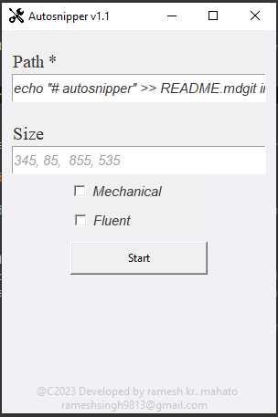

# autosnipper

Autosnipper is a small desktop utility for taking repeated screenshots from the same fixed region without reopening a snipping tool every time. It is designed for workflows where you need to capture many similar images in sequence, such as collecting screenshots from lessons, PDFs, demos, or scrolling content.

## Screenshot



## What problem it solves

When you are taking many screenshots from the same source, the slow part is usually repeating the same crop action again and again. Autosnipper removes that repetition by:

- letting you define one screenshot region once
- saving each capture automatically into a target folder
- using mouse position as a lightweight trigger instead of opening a capture menu each time

This makes batch screenshot collection faster and more consistent.

## How it works

The app starts a simple Tkinter window with:

- a `Path` field for the folder where screenshots will be saved
- a `Size` field for the screenshot region in `x, y, width, height` format
- two presets: `Mechanical` and `Fluent`

After you press `Start`, the app:

1. changes the working directory to the selected output folder
2. keeps checking the current mouse position
3. takes a screenshot when the mouse moves into the trigger area near the top-left side of the screen
4. saves images as `screenshot0.png`, `screenshot1.png`, and so on
5. stops when the mouse is moved to the very top edge of the screen

## Trigger behavior

The screenshot loop is controlled entirely by mouse position:

- capture trigger: mouse `x < 10` and `y > 50`
- stop trigger: mouse `y < 10`

This means you can keep your content open, move the mouse to the left trigger area to capture, then repeat as needed.

## Region presets

The app includes two preset crop modes that update the `Size` field:

- `Mechanical`: starts with `345, 80, ...`
- `Fluent`: starts with `355, 130, ...`

The final width and height are adjusted based on screen height:

- if screen height is above `800`, the app uses `1200, 750`
- otherwise it uses `855, 535`

You can also type your own custom region values manually.

## Tech details

- GUI: `tkinter`
- clipboard path input: `pyperclip`
- mouse tracking and screenshots: `pyautogui`
- packaged executable support: `resource_path()` handles PyInstaller `_MEIPASS`

On launch, the app also reads the current clipboard text and places it into the `Path` field. That makes it convenient if you copy a folder path before opening the program.

## How to run

Install dependencies:

```bash
pip install -r requirements.txt
```

Run the Python app:

```bash
python autosnipper.py
```

## Usage flow

1. Copy or type the destination folder path.
2. Check or edit the screenshot region.
3. Optionally choose `Mechanical` or `Fluent`.
4. Click `Start`.
5. Move the mouse into the left trigger area to save each screenshot.
6. Move the mouse to the top edge of the screen to stop.

## Limitations

- The app depends on fixed screen coordinates, so it works best when your content stays in a stable position.
- It does not provide an on-screen crop selector.
- It is built for desktop use and relies on mouse movement patterns.
- The save path must already exist.
